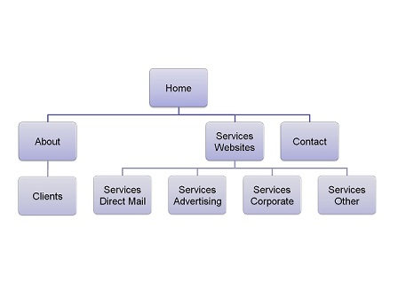
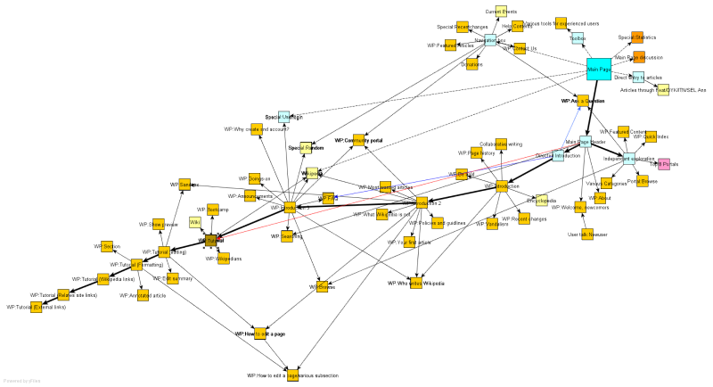

# Interface

## Interface and Common features
_Add here your creative process results using sketchs or wireframes (or even both)_

### Interface Basica

| | |
:---: | :---:
 | 
Interface inicial originada pelo react. 

| | |
:---: | :---:
 |
Interface no seu estado final de desenvolvimento

### Sitemap

_Add a diagram of your (Visual) sitemap. I'm not expecting a [XML Sitemap](https://developers.google.com/search/docs/advanced/sitemaps/build-sitemap#expandable-1) ([Wikipedia](https://en.wikipedia.org/wiki/Sitemaps))_  

_In the previous sections I'm using a table to organize the figures in the space, but it is not required_

Here are two examples of a site map

  
Always add a description to help the user understand the figure  

  
Always add a description to help the user understand the figure  

---
[< Previous](c1.md) | [^ Main](https://github.com/exemploTrabalho/report) | [Next >](c3.md)
:--- | :---: | ---: 
