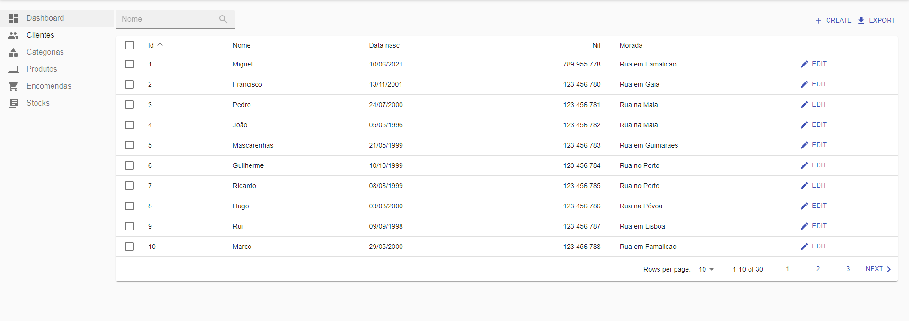
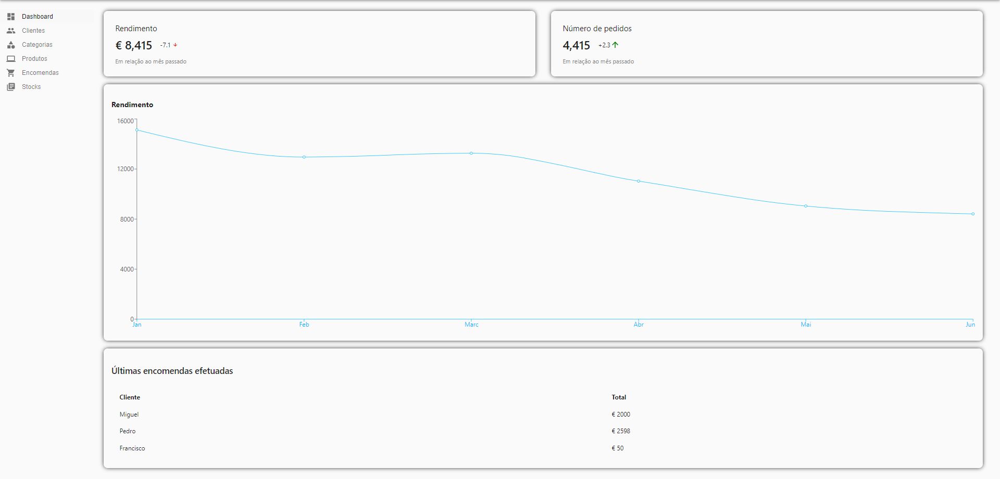
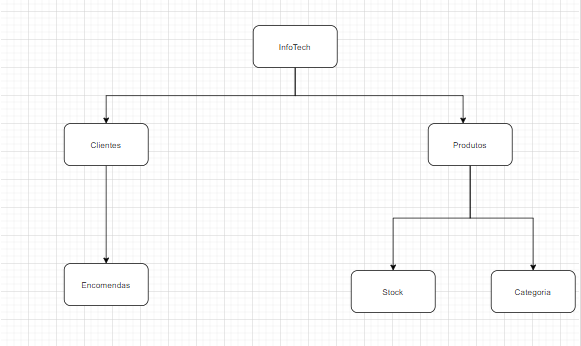
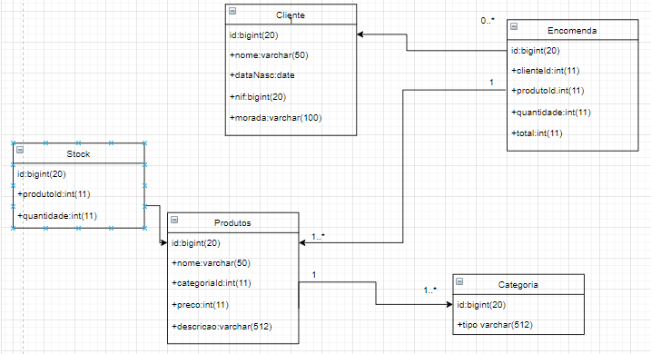

# Interface

### Interface Basica

| | |
:---: | :---:
 | 
Interface inicial originada pelo react. 

### Interface Avançada

| | |
:---: | :---:
 |
Interface no seu estado final de desenvolvimento

### Sitemap

| | |
:---: | :---:
  

### Diagrama de classes

| | |
:---: | :---:
  
Diagrama de classes que representa a estrutura da aplicação web  

---
[< Previous](c1.md) | [^ Main](https://github.com/exemploTrabalho/report) | [Next >](c3.md)
:--- | :---: | ---: 
