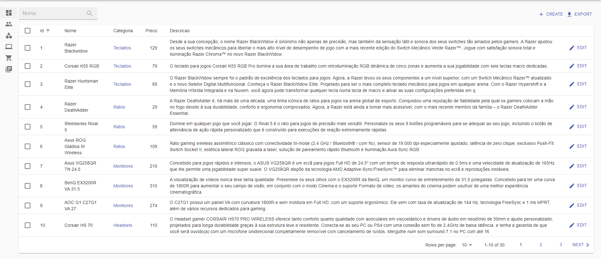
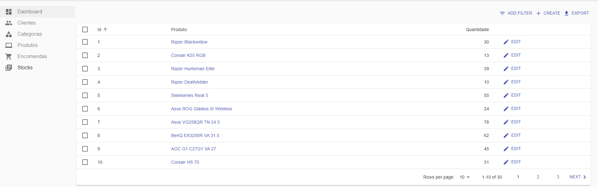

# Apresentação

## DashBoard

A dashboard pretende mostrar o rendimento da InfoTech, o numero de pedidos e permite ainda ver as ultimas encomendas efectuadas.

 

## Cliente

Esta página está relacionada a indexação dos clientes onde é possivel ver, editar e eliminar os dados dos clientes ou até mesmo um cliente. 

## Categoria

Esta página apresenta as diferentes categorias existentes.

## Produtos

Nesta pagina é possível ver os produtos existentes bem como a categoria a que pertencem.

## Encomendas

Na página das encomendas é possível observar os clientes associados a cada encomenda bem como os produtos relacionados com as mesmas.

## Stocks

Nos stocks é possível vizualizar a quantidade existente de cada produto na nossa loja.

---  
[< Previous](c3.md) | [^ Main](https://github.com/Francisco970-hub/M2-PW) | Next >
:--- | :---: | ---: 
